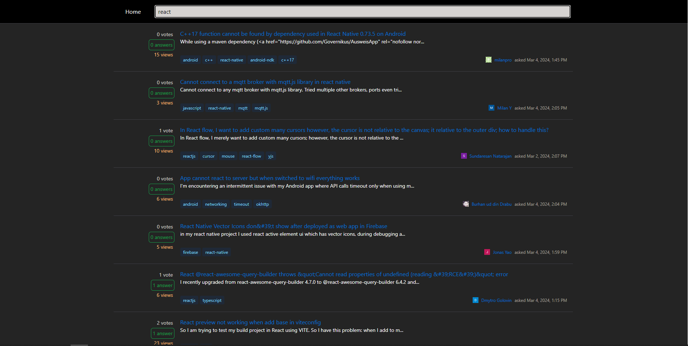
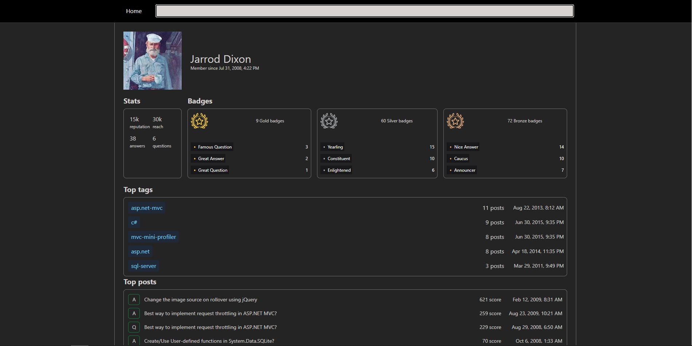

<br />
<div align="center">
  <a href="https://github.com/Tomocza/codecool-stackoverflow">
    
  </a>
</div>
<h3 align="center">Stack overflow-copy</h3>
<p align="left"></p>

## About The Project

Frontend stack-overflow copy using the <a href="https://api.stackexchange.com/">
stack-exchange API</a>!
<br />
Check out the live version on
<a href="https://kozakadam.github.io/stack-overflow/">
git-hub pages</a>! 


<!-- TABLE OF CONTENTS -->
<details>
  <summary>Table of Contents</summary>
  <ol>
    <li>
      <a href="#about-the-project">About The Project</a>
      <ul>
        <li><a href="#built-with">Built With</a></li>
      </ul>
    </li>
    <li>
      <a href="#getting-started">Getting Started</a>
      <ul>
        <li><a href="#installation">Installation</a></li>
      </ul>
    </li>
    <li><a href="#features">Features</a></li>
    <li><a href="#authors">Authors</a></li>
  </ol>
</details>


<!-- ABOUT THE PROJECT -->


## Built with

### Frontend:

![React] <br/> ![Tailwind] <br/> ![JavaScript] <br/>

<p align="right">(<a href="#about-the-project">back to top</a>)</p>

<!-- GETTING STARTED -->
## Getting Started

## Installation

1. Clone the repo
   ```shell
   git clone git@github.com:Kozakadam/stack-overflow.git
   ```

2. Install the frontend packages
     ```shell
     npm install
     ```

3. Start the application
     ```shell
     npm start
     ```

<p align="right">(<a href="#about-the-project">back to top</a>)</p>


<!-- Features -->

## Features:

1. Browsing questions from stackoverflow
   <br />
<div align="center">
    
</div>

2. Visiting user profiles
   <br />
<div align="center">
    
</div>

<!-- AUTHORS -->

## Authors


### Kozák Ádám:

[![Github Pages]](https://github.com/Kozakadam)
[![Gmail]](mailto:kar.adam.robert@gmail.com)
[![LinkedIn]](https://www.linkedin.com/in/kozak-adam-robert/)


<p align="right">(<a href="#about-the-project">back to top</a>)</p>


<!-- MARKDOWN LINKS & IMAGES -->
<!-- https://www.markdownguide.org/basic-syntax/#reference-style-links -->

[Tailwind]: https://img.shields.io/badge/Tailwind-000000?style=for-the-badge&logo=TailwindCSS

[JavaScript]: https://img.shields.io/badge/JavaScript-000000?style=for-the-badge&logo=JavaScript

[React]: https://img.shields.io/badge/React-000000?style=for-the-badge&logo=React

[Java]: https://img.shields.io/badge/Java-000000?style=for-the-badge&logo=openjdk

[SpringBoot]: https://img.shields.io/badge/SpringBoot-000000?style=for-the-badge&logo=SpringBoot

[psql]: https://img.shields.io/badge/postgresql-000000?style=for-the-badge&logo=postgresql

[Github Pages]: https://img.shields.io/badge/github-121013?style=for-the-badge&logo=github&logoColor=white

[Gmail]: https://img.shields.io/badge/Gmail-D14836?style=for-the-badge&logo=gmail&logoColor=white

[LinkedIn]: https://img.shields.io/badge/LinkedIn-0077B5?style=for-the-badge&logo=linkedin&logoColor=white